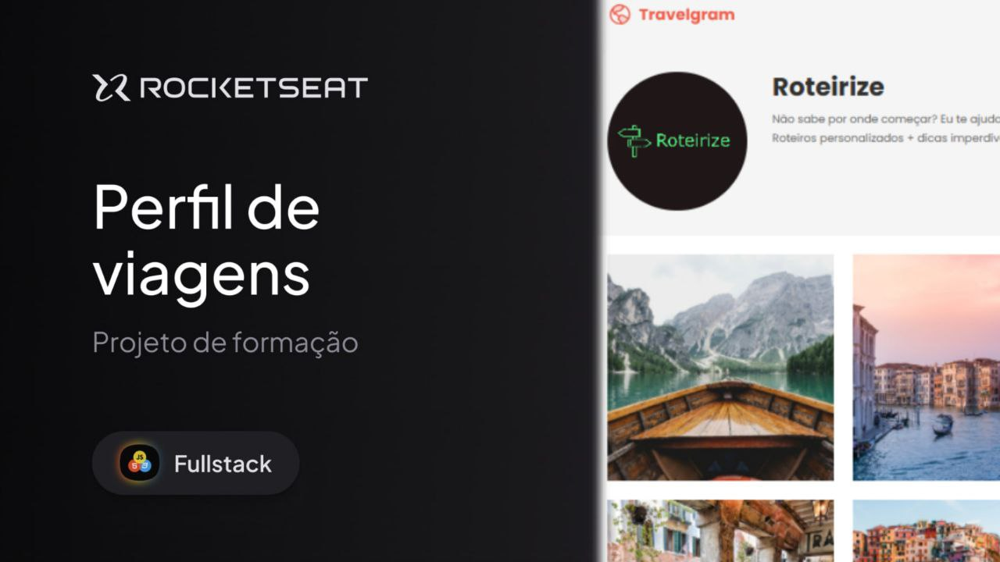

 <h1 align="center"> Projeto: Travelgram </h1>
 

Projeto Travelgram promovido pela Rocketseat para ensino de tecnologias WEB..

  <a href="#-tecnologias">Tecnologias</a>&nbsp;&nbsp;&nbsp;|&nbsp;&nbsp;&nbsp;
  <a href="#-projeto">Projeto</a>&nbsp;&nbsp;&nbsp;|&nbsp;&nbsp;&nbsp;
  <a href="#memo-licença">Licença</a>

  

 

  

## 🚀 Tecnologias

Esse projeto foi desenvolvido com as seguintes tecnologias:

- HTML
- CSS

## Projeto
Neste projeto, desenvolvi uma página de perfil de viagens focando na construção de layout responsivo e organizado com HTML e CSS.

Aprendi a:

Utilizar Flexbox para distribuir e alinhar elementos com responsividade;

Trabalhar com variáveis CSS para cores, espaçamentos e tipografia;

Estruturar e estilizar componentes como navegação, header, galeria de imagens e footer;

Implementar fontes personalizadas com Google Fonts;

Criar um layout consistente com classes utilitárias como .container;

Organizar o código separando estilos globais e mantendo boas práticas;

Utilizar ferramentas como Emmet, Live Server e Git no fluxo de desenvolvimento.

Foi um exercício importante para transformar um layout do Figma em uma interface funcional, reforçando tanto a parte visual quanto técnica da construção de páginas web.